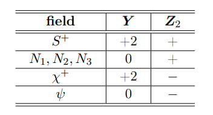
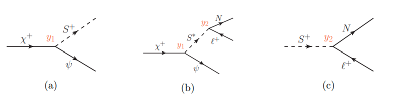

The dark matter model simulated during this project is introduced by Sreemanti Chakraborti, Victoria Martin, and Poulose Poulose in the paper [Freeze-in and Freeze-out of Dark Matter with Charged Long-lived Partners](https://arxiv.org/abs/1904.09945).

The newly introduced particles are the following:

and the interactions we focused on are: 

## Particles
- Charged fermionic companion particle $\chi^+$
- Charged bosonic particle $S^+$
- Leptonic heavy neutrinos $N_1$, $N_2$, and $N_3$
- Dark matter candidate $\psi$
